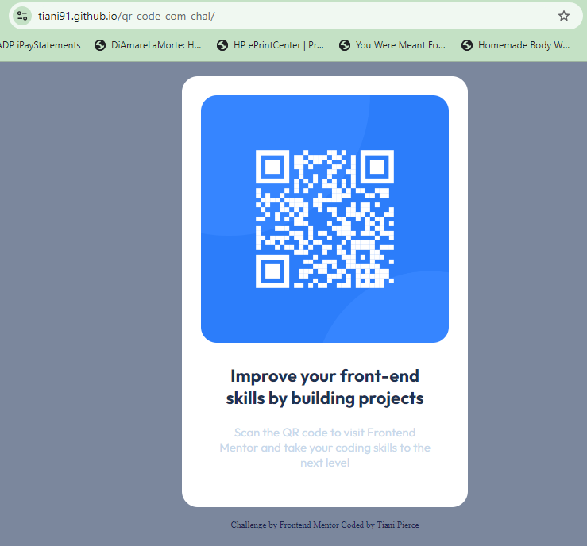

QR-Code Component Challenge aka qr-code-com-chal
This is a solution to the [QR code component challenge on Frontend Mentor](https://www.frontendmentor.io/challenges/qr-code-component-iux_sIO_H). Frontend Mentor challenges help you improve your coding skills by building realistic projects. 

## Table of contents

- [Overview](#overview)
  - [Screenshot](#screenshot)
  - [Links](#links)
- [My process](#my-process)
  - [Built with](#built-with)
  - [What I learned](#what-i-learned)
  - [Continued development](#continued-development)
  - [Useful resources](#useful-resources)
- [Author](#author)

**Note: Delete this note and update the table of contents based on what sections you keep.**

## Overview

In this challenge I was to build the QR code component and get it as close to the original design as possible utilizing HTML and CSS in a responsive design concept.

### Screenshots

Original Design


Personal Design based off of Original Design




### Links

- Solution URL: [My Solution](https://github.com/Tiani91/qr-code-com-chal)
- Live Site URL: [My Site for the Solution](https://tiani91.github.io/qr-code-com-chal/)

## My process

I took the provided material and used [Penpot](https://design.penpot.app) as a way to view the code for the design layout to gain a better understanding for the sizing of the containers in which the QR Code sat inside. After gaining that information I was able to utilize the information provided within the zip file to gain the proper sizing to the text elements. 

In order for me to convert the sizing of the text elements, as well as the padding and radius I utilized the [CSS Font Size](https://www.w3schools.com/css/css_font_size.asp) to figure out how to calculate from px to em and vh/vw. I also utilized the conversion calculator found here [CSS PX to EM Conversion Calculator](https://www.w3schools.com/tags/ref_pxtoemconversion.asp).

### Built with

- HTML5
- CSS3
- Flexbox
- CSS Grid
- CSS Responsive

### What I learned

In doing this challenge I learned how to calculate from px to vh/vw and em/rem. It was also a great refresher for me for working with Responsive Web Design and working with HTML5 and CSS3. I also learned that it's better to use vh/vx and em/rem instead of px when you're making a website for responsive as the browsers read them more easily. 

Code I'm proud of:

```css
.text {
    font-family: 'Outfit', sans-serif;
    text-align: center;
    padding: 1.45rem;
    margin: 0;
```
The why:

I was having difficulty figuring out what I did wrong when I was working on removing the text class from my h1 and p tags. When I removed the text class from those tags it made my entire card shrink and shrivel up and there was NO spaces in it at all. After I added the padding and margin to the text class itself, it fixed the issue by providing the space I needed between the QR code, and the text within the block. I'm so glad that it worked because I really didn't want to have to add the text classes back to the tags in my CSS, mainly because in my h1 tag I have a padding-bottom which provides the space between the h1 and p tags. 

### Continued development

I plan to keep this as a learning venture and a reminder to utilize vh/vx and em/rem for sizing options when creating responsive websites and so I can remember where to go if I forget how to do the calculations. 
As I continue down the road of front-end web development I will continue to look back on this project and see the changes and growth I have acquired. This project alone will have no other development, but I do plan on creating more projects to add to my ever-growing list of repos and projects in hopes that I can become a successful and professional developer.

### Useful resources

- [4 Ways to add images to GitHub](https://cloudinary.com/guides/web-performance/4-ways-to-add-images-to-github-readme-1-bonus-method#:~:text=Open%20the%20folder%20containing%20the,you%20want%20it%20to%20appear.&text=Click%20Preview%20to%20see%20how,README%20with%20the%20new%20image.) - This helped me to learn how to add the images in this README file. I really liked this article and will use it moving forward as there is a vast amount of information in it.
- [How To Write A Good README file](https://www.freecodecamp.org/news/how-to-write-a-good-readme-file/) - This is an amazing article which helped me finally understand how to write a good README file. I'd recommend it to anyone still learning this concept.
- [Penpot](https://design.penpot.app/#/auth/login) - This helped me to see the coding for the images provided in the project, and is FREE, you don't have to pay in order to see the code. 
- [CSS Font Size](https://www.w3schools.com/css/css_font_size.asp) - Helped me to figure out how to calculate from px to vh/em.
- [CSS PX to EM Conversion Calculator](https://www.w3schools.com/tags/ref_pxtoemconversion.asp) - This is a conversion calculator so that you don't have to use a calculator to find the em from px. 

## Author

- Website - In Creation
- Frontend Mentor - [@Tiani91](https://www.frontendmentor.io/profile/Tiani91)
- Twitter/X - [@TianiPierce](https://www.twitter.com/TianiPierce)
